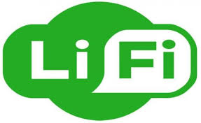
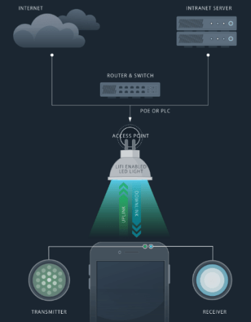

# LIFI

### Apa Itu LIFI? 
   LIFI atau Light Fidelity merupakan teknologi komunikasi nirkabel dua arah yang berkecepatan tinggi. 
dan mirip dengan teknologi Wi-Fi. Li-Fi memanfaatkan lampu LED untuk mentransfer data pada spektrum cahaya tampak. Sementara Wi-Fi atau Wireless Fidelity, menggunakan gelombang elektromagnetik pada frekuensi radio untuk mengirimkan data melalui router Wi-Fi. Perbedaan antara keduanya beragam, yang paling jelas adalah Wi-Fi menggunakan gelombang radio, sedangkan Li-Fi memanfaatkan cahaya

### Bagaimana cara kerja LIFI?

LiFi dirancang untuk menggunakan bola lampu LED yang serupa dengan yang saat ini digunakan di banyak rumah dan kantor yang sadar energi. Namun, lampu LiFi dilengkapi dengan chip yang memodulasi cahaya untuk transmisi data optik. Data LiFi ditransmisikan oleh lampu LED dan diterima oleh fotoreseptor seperti pada Gambar

Agar Li-Fi bisa bekerja, dibutuhkan dua sumber cahaya yang dipasang pada masing-masing ujung perangkat. Contoh sumber cahaya yang bisa dipakai adalah detektor foto (Light Sensor) dan LED. Ketika cahaya LED hidup, maka cahaya sensor pada ujung perangkat lainnya akan mendeteksi dan mengartikannya sebagai biner 1. Jumlah cahaya yang ada pada LED tersebut akan mengirimkan pesan yang akan ditangkap oleh detektor cahaya pada perangkat satunya.

